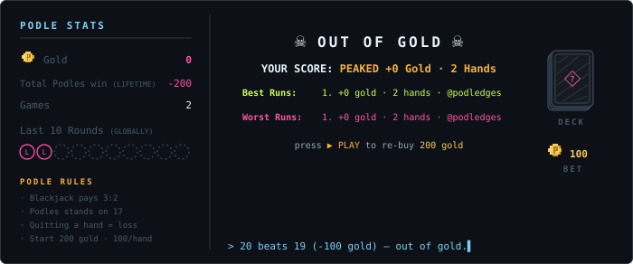

&nbsp;&nbsp;
 
<a href="https://podledges.github.io/podledges/"><b>⚡ or play the instant table — one click a move, no login, right now</b></a>

a lit button opens a pre-filled issue → press <em>Create</em> → the dealer plays it and updates the table in ~20s the table is shared, the P&amp;L is eternal, and quitting a live hand counts as a loss

