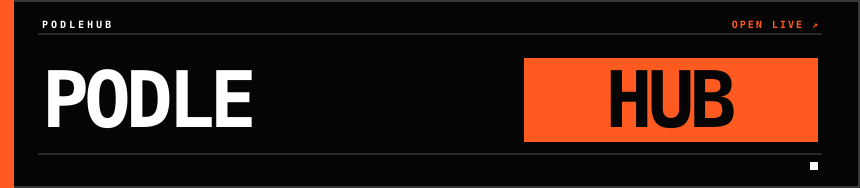

GitHub contribution-calendar statistics, not authored-commit counts. Refresh is scheduled every eight hours; the image shows the last successful retrieval and the latest day is partial. Open the streak for full-size panels and the readable fourteen-day table; open the waveform for its interactive version.

